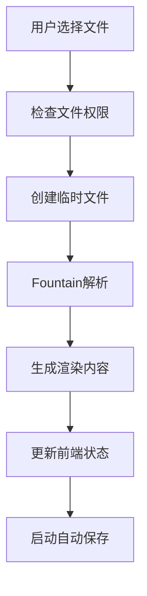
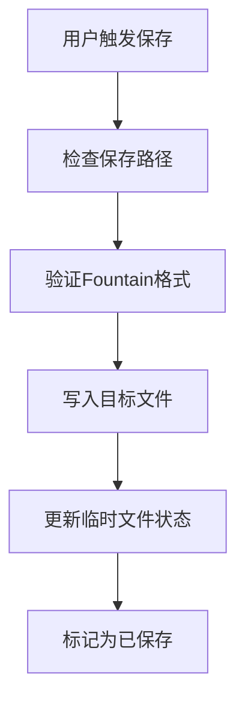
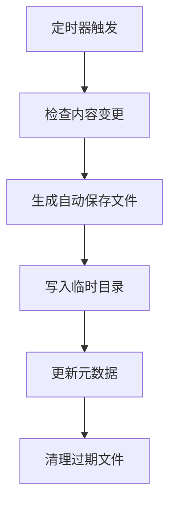

# **ThypingScripts - 临时文件系统架构文档**

文件名称： ThypingScripts - 临时文件系统架构 V1.0  
创建人： gellar  
创建日期： 2025-10-24  
最近更新： 2025-10-24  
关联版本： ThypingScripts - 架构与规范 V1.0

## **1. 临时文件系统概述**

ThypingScripts采用临时文件系统作为核心数据管理机制，确保跨平台兼容性和数据安全性。

### **1.1 设计原则**

- **跨平台兼容**：支持Windows、macOS、Linux的临时目录
- **数据安全**：所有编辑内容都基于临时文件，避免数据丢失
- **性能优化**：系统级响应速度，延迟最小化
- **崩溃恢复**：应用启动时自动检查未完成的临时文件

### **1.2 核心组件**

```
临时文件系统
├── 临时文件管理器 (TempFileManager)
├── Fountain解析器 (FountainParser)
├── 渲染引擎 (Renderer)
├── 自动保存服务 (AutosaveService)
└── 崩溃恢复服务 (RecoveryService)
```

## **2. 文件管理架构**

### **2.1 临时文件结构**

```
临时目录/
├── thypingscripts/
│   ├── sessions/           # 会话临时文件
│   │   ├── session_001.tmp
│   │   └── session_002.tmp
│   ├── autosave/           # 自动保存文件
│   │   ├── autosave_001.auto
│   │   └── autosave_002.auto
│   └── recovery/           # 崩溃恢复文件
│       └── crash_recovery.json
```

### **2.2 临时文件格式**

```rust
pub struct TempFile {
    pub id: String,                    // 唯一标识符
    pub content: String,                // Fountain内容
    pub save_path: Option<String>,      // 用户选择的保存路径
    pub is_saved: bool,                // 是否已保存
    pub created_at: DateTime,           // 创建时间
    pub modified_at: DateTime,          // 最后修改时间
    pub autosave_enabled: bool,         // 是否启用自动保存
    pub metadata: TempFileMetadata,     // 元数据
}

pub struct TempFileMetadata {
    pub title: String,                  // 剧本标题
    pub author: String,                 // 作者
    pub version: String,                // 版本
    pub word_count: u32,               // 字数统计
    pub character_count: u32,       // 角色数量
    pub scene_count: u32,              // 场景数量
}
```

## **3. 核心工作流程**

### **3.1 文件打开流程**



### **3.2 文件保存流程**



### **3.3 自动保存流程**



## **4. 跨平台临时目录**

### **4.1 目录选择策略**

| 操作系统 | 临时目录路径 | 权限要求 |
| :---- | :---- | :---- |
| **Windows** | `%TEMP%\thypingscripts\` | 读写权限 |
| **macOS** | `~/Library/Caches/thypingscripts/` | 读写权限 |
| **Linux** | `~/.cache/thypingscripts/` | 读写权限 |

### **4.2 权限管理**

```rust
pub struct TempDirectoryManager {
    pub base_path: PathBuf,
    pub permissions: FilePermissions,
    pub cleanup_policy: CleanupPolicy,
}

impl TempDirectoryManager {
    pub fn create_temp_dir() -> Result<PathBuf, TempFileError> {
        // 跨平台临时目录创建逻辑
    }
    
    pub fn ensure_permissions(&self) -> Result<(), TempFileError> {
        // 权限检查和设置
    }
}
```

## **5. 自动保存与恢复**

### **5.1 自动保存机制**

```rust
pub struct AutosaveService {
    pub interval: Duration,           // 保存间隔（默认30秒）
    pub max_files: usize,              // 最大自动保存文件数
    pub cleanup_after: Duration,       // 清理过期文件时间
}

impl AutosaveService {
    pub fn start_autosave(&self, temp_file: &TempFile) {
        // 启动自动保存定时器
    }
    
    pub fn save_autosave(&self, content: &str) -> Result<(), AutosaveError> {
        // 执行自动保存
    }
    
    pub fn cleanup_old_files(&self) {
        // 清理过期文件
    }
}
```

### **5.2 崩溃恢复机制**

```rust
pub struct RecoveryService {
    pub recovery_file: PathBuf,
    pub max_recovery_files: usize,
}

impl RecoveryService {
    pub fn check_crash_recovery(&self) -> Vec<RecoveryFile> {
        // 检查崩溃恢复文件
    }
    
    pub fn create_recovery_file(&self, temp_file: &TempFile) {
        // 创建恢复文件
    }
    
    pub fn restore_from_recovery(&self, recovery_id: &str) -> Result<TempFile, RecoveryError> {
        // 从恢复文件恢复
    }
}
```

## **6. 性能优化**

### **6.1 内存管理**

- **流式处理**：大文件使用流式读取，避免内存溢出
- **增量更新**：只处理变更的内容部分
- **缓存机制**：缓存解析结果，减少重复计算

### **6.2 文件I/O优化**

- **异步I/O**：使用Tokio异步运行时
- **批量操作**：合并多个小文件操作
- **预读机制**：预测用户操作，提前加载数据

## **7. 错误处理**

### **7.1 错误类型**

```rust
pub enum TempFileError {
    PermissionDenied(String),
    DiskFull(String),
    InvalidPath(String),
    ParseError(String),
    RecoveryError(String),
}
```

### **7.2 错误恢复策略**

- **权限错误**：提示用户选择其他目录
- **磁盘空间不足**：清理临时文件，提示用户
- **解析错误**：保留原始内容，标记错误位置
- **恢复失败**：提供手动恢复选项

## **8. 安全考虑**

### **8.1 数据安全**

- **文件权限**：严格控制临时文件访问权限
- **内容加密**：敏感内容可选择加密存储
- **清理策略**：定期清理临时文件，避免数据泄露

### **8.2 隐私保护**

- **本地存储**：所有数据仅存储在本地
- **无网络传输**：不向外部服务器发送数据
- **用户控制**：用户完全控制数据存储位置

## **9. 测试策略**

### **9.1 单元测试**

- **文件操作测试**：各种文件读写场景
- **权限测试**：不同权限下的行为
- **错误处理测试**：异常情况处理

### **9.2 集成测试**

- **跨平台测试**：在不同操作系统上测试
- **性能测试**：大文件处理性能
- **恢复测试**：崩溃恢复功能测试

## **10. 未来扩展**

### **10.1 计划功能**

- **版本控制**：基于临时文件的本地版本管理
- **协作支持**：多用户临时文件同步
- **云同步**：可选的云存储集成

### **10.2 优化方向**

- **压缩存储**：临时文件压缩存储
- **增量同步**：只同步变更部分
- **智能清理**：基于使用模式的智能清理

---

**实现优先级：**
1. 基础临时文件管理
2. 自动保存机制
3. 崩溃恢复功能
4. 性能优化
5. 高级功能扩展
